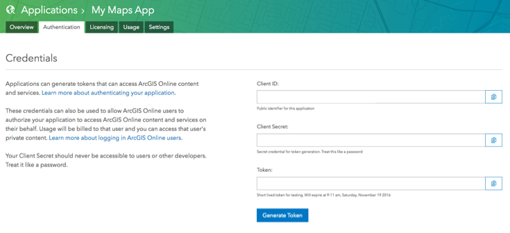

# Mapbook Android
This repo is home to the mobile mapbook app, an example application using the [ArcGIS Runtime SDK for Android.](https://developers.arcgis.com/android/) Replace the paper maps you use for field work with offline maps.

Visit Esri's[ **example app site** ](https://developers.arcgis.com/example-apps/mapbook-android/)to read more about this app and how the Runtime features are implemented.
Join our[ **GeoNet community** ](https://community.esri.com/groups/arcgis-example-apps)and keep up to date on the latest discussions about example-apps!

## Features
- Mobile map packages
- Feature layers
- Identify
- Table of Contents
- Show a legend
- Use a map view callout
- Geocode addresses
- Suggestion search
- Bookmarks
- Sign in to an ArcGIS account


## Development Instructions
This mapbook repo is an Android Studio Project and App Module that can be directly cloned and imported into Android Studio.

* Login to [ArcGIS for Developers](https://developers.arcgis.com/) and [register](https://developers.arcgis.com/applications/#/) your app.  



* Once you've registered your version of the mapbook app, grab a copy of the client id from the registration and set the client id in the applications app_settings.xml file.  

```xml
<?xml version="1.0" encoding="utf-8"?>
<resources>

    <!-- TODO: add your own client id here-->
    <string name="client_id">YOUR_CLIENT_ID</string>

    <!-- This redirect URI is the default value for https://www.arcgis.com -->
    <string name="redirect_uri">my-ags-app://auth</string>

</resources>
```
* As part of the registration process, add a redirect uri for your app.  Navigate to the Redirect URIs section at the bottom of the registration page and set the redirect uri to `my-ags-app://auth`.  This redirect uri is the default redirect for `https://www.arcgis.com`.


* Note that the scheme for the `DefaultOAuthIntentReceiver` in the Android Manifest file is derived from the redirect uri.
```xml
        <activity
            android:name="com.esri.arcgisruntime.security.DefaultOAuthIntentReceiver"
            android:label="OAuthIntentReceiver"
            android:launchMode="singleTask">
            <intent-filter>
                <action android:name="android.intent.action.VIEW"/>
                <category android:name="android.intent.category.DEFAULT"/>
                <category android:name="android.intent.category.BROWSABLE"/>

                <data android:scheme="my-ags-app"/>
            </intent-filter>
        </activity>
 ```


### Fork the repo
**Fork** the Mapbook for Android repo.

### Clone the repo
Once you have forked the repo, you can make a clone

#### Command line Git
1. [Clone the  Mapbook for Android repo](https://help.github.com/articles/fork-a-repo#step-2-clone-your-fork)
2. ```cd``` into the ```mapbook-android``` folder
3. Make your changes and create a [pull request](https://help.github.com/articles/creating-a-pull-request)

### Configuring a Remote for a Fork
If you make changes in the fork and would like to [sync](https://help.github.com/articles/syncing-a-fork/) those changes with the upstream repository, you must first [configure the remote](https://help.github.com/articles/configuring-a-remote-for-a-fork/). This will be required when you have created local branches and would like to make a [pull request](https://help.github.com/articles/creating-a-pull-request) to your upstream branch.

1. In the Terminal (for Mac users) or command prompt (fow Windows and Linux users) type ```git remote -v``` to list the current configured remote repo for your fork.
2. ```git remote add upstream https://github.com/Esri/mapbook-android``` to specify new remote upstream repository that will be synced with the fork. You can type ```git remote -v``` to verify the new upstream.

If there are changes made in the Original repository, you can sync the fork to keep it updated with upstream repository.

1. In the terminal, change the current working directory to your local project
2. Type ```git fetch upstream``` to fetch the commits from the upstream repository
3. ```git checkout master``` to checkout your fork's local master branch.
4. ```git merge upstream/master``` to sync your local `master' branch with `upstream/master`. **Note**: Your local changes will be retained and your fork's master branch will be in sync with the upstream repository.


## Testing With Robotium
The project includes a small suite of Robotium tests that test various features of the application.  The Robotium tests for the mapbook-app will run best on an attached device, rather than in the emulator.  Use the following steps to configure your environment for running the tests.  During some of the tests, screen shots are captured by Robotium and by default are stored in the /sdcard/Robotium-Screenshots/ directory on the device.  See [```Solo.takeScreenshot()```](http://recorder.robotium.com/javadoc/com/robotium/solo/Solo.html#takeScreenshot()) for more information.

1.  Attach a non-emulated Android device to your computer.
2.  Ensure location services are enabled on the Android device.
3.  Ensure you have internet connectivity on the Android device.
4.  Adjust the entries in your values/app_settings.xml.
5.  Right-click on the MapbookTest.java file in Android Studio and select Run 'MapbookTest'.

## Requirements
* [JDK 6 or higher](http://www.oracle.com/technetwork/java/javase/downloads/index.html)
* [Android Studio](http://developer.android.com/sdk/index.html)

## Resources
* [ArcGIS Runtime SDK for Android Developers Site](https://developers.arcgis.com/android/)
* [ArcGIS Mobile Blog](http://blogs.esri.com/esri/arcgis/category/mobile/)
* [ArcGIS Developer Blog](http://blogs.esri.com/esri/arcgis/category/developer/)
* [Google+](https://plus.google.com/+esri/posts)
* [twitter@ArcGISRuntime](https://twitter.com/ArcGISRuntime)
* [twitter@esri](http://twitter.com/esri)
## Issues

Find a bug or want to request a new feature enhancement? Let us know by submitting an issue.

## Contributing
Anyone and everyone is welcome to contribute. We do accept pull requests.

1. Get involved
2. Report issues
3. Contribute code
4. Improve documentation
## Licensing
Copyright 2017 Esri

Licensed under the Apache License, Version 2.0 (the "License"); you may not use this file except in compliance with the License. You may obtain a copy of the License at

http://www.apache.org/licenses/LICENSE-2.0

Unless required by applicable law or agreed to in writing, software distributed under the License is distributed on an "AS IS" BASIS, WITHOUT WARRANTIES OR CONDITIONS OF ANY KIND, either express or implied. See the License for the specific language governing permissions and limitations under the License.

A copy of the license is available in the repository's [LICENSE](LICENSE) file.

For information about licensing your deployed app, see [License your app](https://developers.arcgis.com/android/guide/license-your-app.htm).
